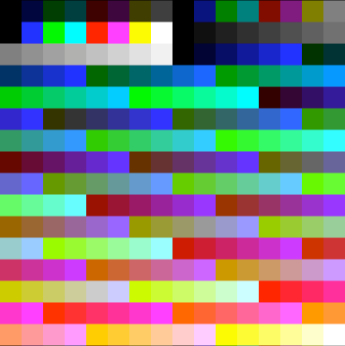

# The Palette

The 4025 Video Generator is capable of rendering up to 256 colors onscreen at once, from an overall palette of 24-bit color. Changing the palette will affect everything onscreen, making it possible to create faux-animation simply by cycling portions of the palette \(color cycling\), or making it possible to fade content in and out simply by changing brightness levels.

The palette is located at 0x1FC00 and continues to 0x1FFFF. There are 256 entries each consisting of an ignored byte \(set to 0xFF\) and the red, green, and blue component of the color. The arrangement is as follows:

| Entry | +1 | +2 | +3 | +4 |
| :--- | :--- | :--- | :--- | :--- |
| 0x00 \(0x1FC00\) | red | green | blue | 0xFF |
| 0x01 \(0x1FC04\) | red | green | blue | 0xFF |
| ... | | | | |
| 0xFF \(0x1FFFC\) | red | green | blue | 0xFF |

An initial palette is configured upon cold boot, however this palette can be overridden at any time.

## The initial palette

The initial palette is configured by the `RESET` routine located at `0xFF00` and triggered on every cold and warm reset. 

The palette consists of the following:

* 24 RGBI color entries (indices 0–23)
* 16 shades of gray (indices 24–39)
* 216 6-level RGB colors (indicies 40–255)
    * These can be accessed by using `40 + ((R/51)*36) + ((G/51)*6) + (B/51)`, where `R`, `G`, and `B` are between `0` and `255` inclusive.

In the initial palette some colors are duplicated, meaning that there aren't 256 distinct colors available for use, but the palette can be redefined to whatever values are needed. Keep in mind that if you do redefine the palette, the palette will be lost after `RESET`.

